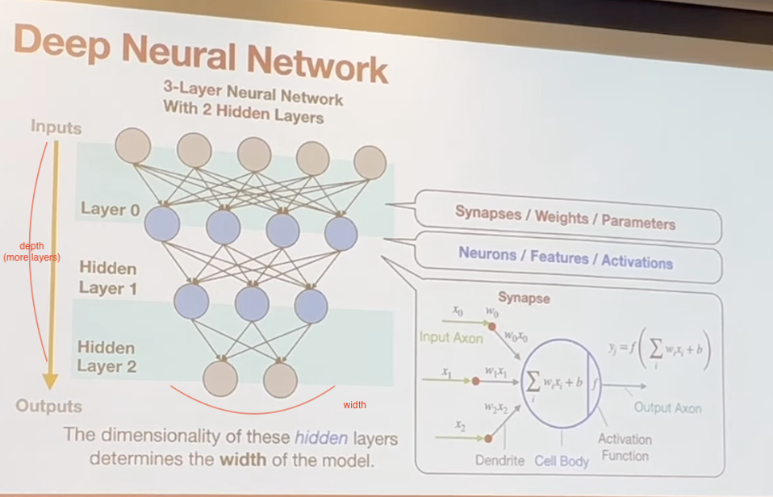

# EfficientML - Lecture 2

[https://www.youtube.com/watch?v=Q9bdjoVx_m4](https://www.youtube.com/watch?v=Q9bdjoVx_m4)

## Deep Neural Network
- synapses = weights = parameters
- neurons = features = activations

The dimensionality of the hidden layers determines the **width** of the model.

### Fully-Connected Layer (Linear Layer)
The output neuron is connected to all input neurons.

- Shape of tensors:
  - Input features (X)
  - Ouput features (Y)
  - Weights (W) - input agnostic
  - Bias (b) - input agnostic

### Convolution Layer
The output neuron is connected to input neurons in the receptive field.

  

