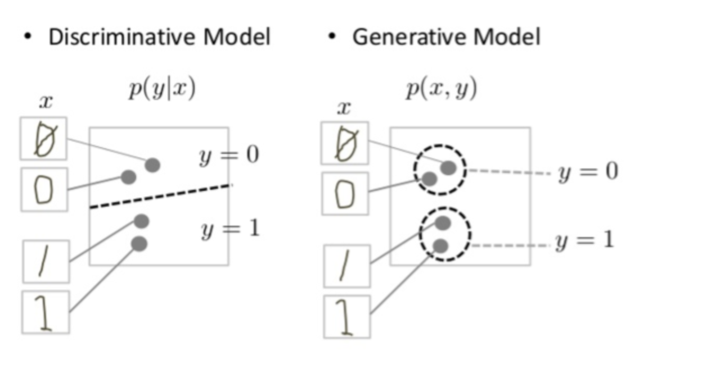

# GAN (generative adversarial network)

**TLDR example application**: Used to create faces of real-looking humans, though the faces aren't any particular person's.

## Intro

GANs are a kind of generative models (as opposed to discriminative models, although it has a discriminator part...)

## Generative Models 
- Generate new data instances (eg. generates a new animal that looks like some kind of animal)
- Generally more involved than analogous discriminative models, since they may capture correlations like **"things that look like boats will probably appear near things that look like water"** vs discriminative models can differentiate a "sailboat" from "not a sailboat" by looking for just a few tell-tale patterns.
- Tries to model **how data is placed through the space**

## Discriminative Models
- Discriminates between different kinds of data instances (eg. cat vs dog)
- Ignores whether a given instance is likely, just says how likely a label applies to the instance
- Tries to **draw boundaries in the data space**

Discriminative models try to differentiate 0's and 1's by drawing a line in the data space. It may never have to model exactly where the instances are on either side of the line.

Generative models try to produce convincing 0's and 1's by generating digits that fall close to those counterparts in the data space.

## Overview of GAN Structure

An ML model in which **two neural networks compete** with each other by using deep learning methods to become more accurate in their predictions.

Thus "adversarial".

The two parts (neural networks) are:

- the **generator**, which learns to generate plausible data.
- the **discriminator** (basically a classifier), which learns to distinguish the generator's fake data from real data. The discriminator penalizes the generator for producing implausible results.

The **generator's output is connected to the discriminator's input**. 

Via **backpropagation**, the discriminator's classification provides a signal that the generator uses to update its weights.

## Summary of Training Steps
1. The generator makes obviously fake data.
2. The discriminator quickly learns it's fake.
3. The generator learns to produce more realistic data that can fool the discriminator.
4. If all goes well, the discriminator gets worse at differentiating between real and fake data. It starts classifying fake data as real, and the discriminator's accuracy goes down.

GAN training usually alternates back and forth between the discriminator training for 1+ epochs, then the generator.

If the generator is 'perfect', then the discriminator has a 50% accuracy.
So the problem is that the discriminator output gets less meaningful. 
If the GAN is overtrained to the point that the discriminator is giving random feedback, then the generator starts training on junk feedback.

**Convergence** a fleeting, rather than stable, state.

--- 

## The Discriminator

Simply a classifier.

### Discriminator Training

Its training data comes from 2 sources:

- **Real data**: These are positive examples during training
- **Fake data**: Created by the generator. These are negative examples during training.

**During discriminator training**
1. The discriminator classifies both real and fake data from the generator.
2. The discriminator loss penalizes the discriminator for misclassifying a real instance as fake or a fake instance as real.
3. The discriminator updates its weights through **backpropagation** from the discriminator loss through the discriminator network.

Other notes on discriminator training
- the generator doesn't train (its weights remain constant)
- the discriminator ignores generator loss and just uses discriminator loss

--- 

## The Generator

### Generator Training
- Requires tighter integration between the generator and the discriminator.

1. Provide random input
2. Generator produces output from sampled random input
3. Discriminator classifies the generated output (discriminator stays constant)
4. Calculate loss from the discriminator classification
5. Uses backpropagation to go through both the discriminator and generator to get gradients
6. Use gradients to change only the generator weights

---

## Loss Functions

GANs should use loss functions that reflect the **distance between the distribution of the data generated by the GAN** and the **distribution of the real data**.

Two common GAN loss functions:
- **minimax loss)**: the original loss function from the GAN paper (2014)
- **Wassterstein loss**: default loss function for TF-GAN (tensorflow GAN) estimators (2017)

Although it's possible to just use the same loss function, it's more common that a GAN has 2 loss functions, one for the generator, one for the discriminator.

---

## GAN Problems

### Vanishing Gradients

If your discriminator is too good, then generator training can fail due to vanishing gradients.

### Mode Collapse

You usually want a GAN to produce a wide variety of outputs. If it produces an especially plausible output, the generator may produce only that output, which causes the discriminator to always reject it.

Each generator iteration then starts over optimizing for a particular discriminator.

### Failure to Converge

GANs can fail to converge (and frequently do).

-- 

## GAN Variations

- **progressive GANs**: the generator's first layers produce very low res images, with the subsequent layers adding details. Allows GAN to train more quickly.
- **conditional GANs**: train on a labeled data set + lets you specify the label for each generated instance.
- **image-to-image translation**: Takes an image as input and maps it to a generated output image w/ different properties
- **CycleGANs**: transforms images from 1 set into images that could belong in another set (eg. horses to zebras). Training data uses 2 sets of images (horses, zebras).